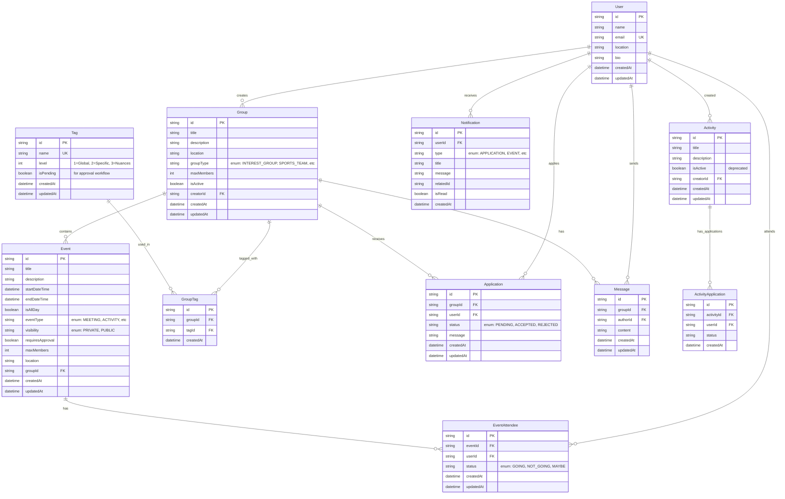
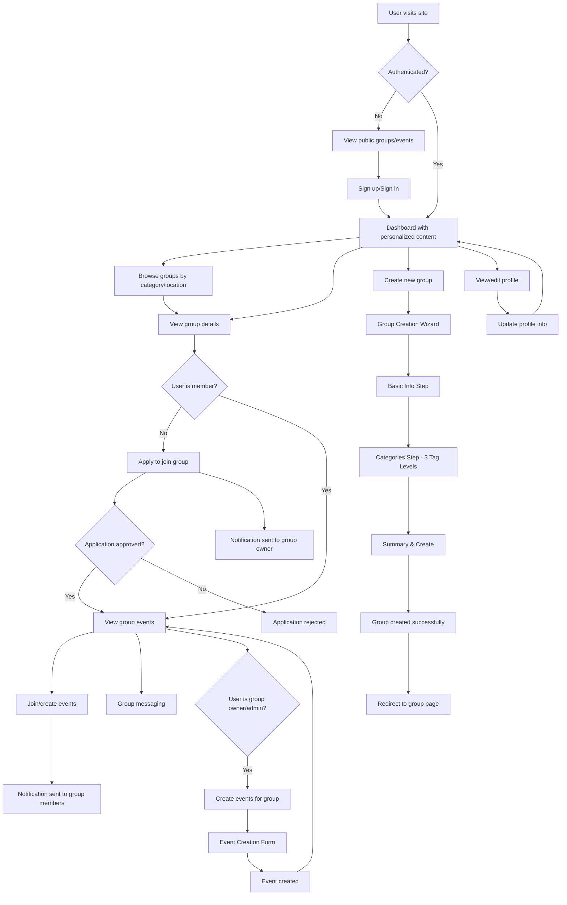
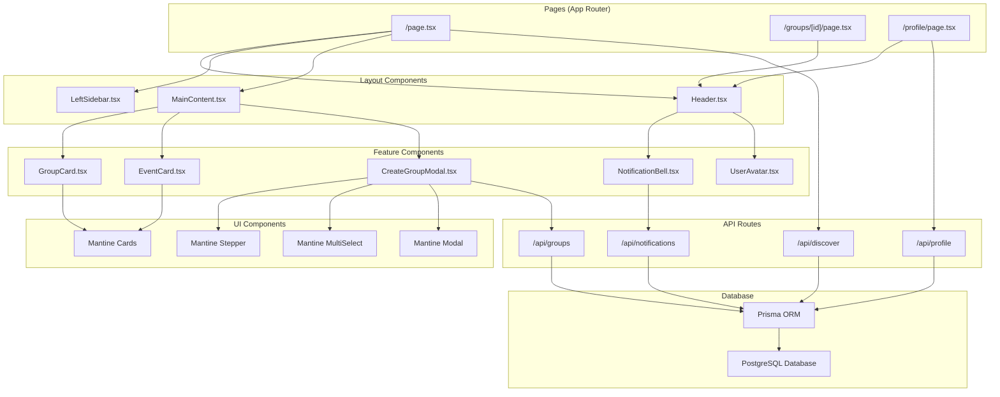
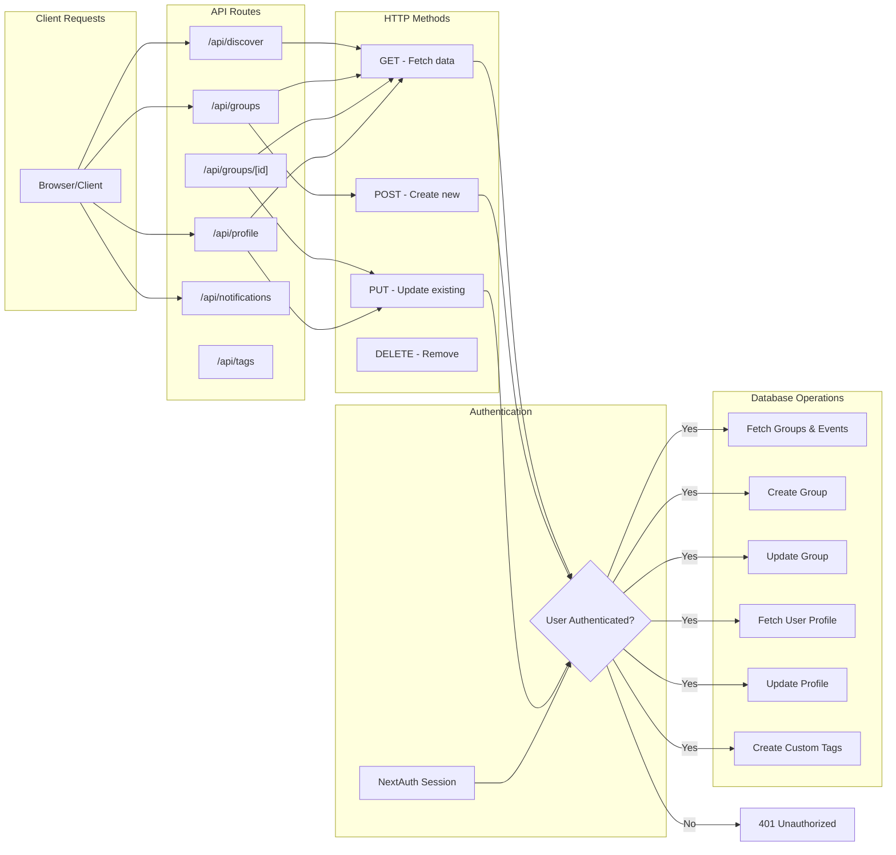

# Architecture Documentation

## Database Relationships (Entity-Relationship Diagram)

```mermaid
erDiagram
    User {
        string id PK
        string name
        string email UK
        string location
        string bio
        datetime createdAt
        datetime updatedAt
    }

    Group {
        string id PK
        string title
        string description
        string location
        string groupType "enum: INTEREST_GROUP, SPORTS_TEAM, etc"
        int maxMembers
        boolean isActive
        string creatorId FK
        datetime createdAt
        datetime updatedAt
    }

    Event {
        string id PK
        string title
        string description
        datetime startDateTime
        datetime endDateTime
        boolean isAllDay
        string eventType "enum: MEETING, ACTIVITY, etc"
        string visibility "enum: PRIVATE, PUBLIC"
        boolean requiresApproval
        int maxMembers
        string location
        string groupId FK
        datetime createdAt
        datetime updatedAt
    }

    Tag {
        string id PK
        string name UK
        int level "1=Global, 2=Specific, 3=Nuances"
        boolean isPending "for approval workflow"
        datetime createdAt
        datetime updatedAt
    }

    GroupTag {
        string id PK
        string groupId FK
        string tagId FK
        datetime createdAt
    }

    Application {
        string id PK
        string groupId FK
        string userId FK
        string status "enum: PENDING, ACCEPTED, REJECTED"
        string message
        datetime createdAt
        datetime updatedAt
    }

    EventAttendee {
        string id PK
        string eventId FK
        string userId FK
        string status "enum: GOING, NOT_GOING, MAYBE"
        datetime createdAt
        datetime updatedAt
    }

    Notification {
        string id PK
        string userId FK
        string type "enum: APPLICATION, EVENT, etc"
        string title
        string message
        string relatedId
        boolean isRead
        datetime createdAt
    }

    Message {
        string id PK
        string groupId FK
        string authorId FK
        string content
        datetime createdAt
        datetime updatedAt
    }

    %% Legacy Activity Models (for migration)
    Activity {
        string id PK
        string title
        string description
        boolean isActive "deprecated"
        string creatorId FK
        datetime createdAt
        datetime updatedAt
    }

    ActivityApplication {
        string id PK
        string activityId FK
        string userId FK
        string status
        datetime createdAt
    }

    %% Primary Relationships
    User ||--o{ Group : creates
    User ||--o{ Application : applies
    User ||--o{ EventAttendee : attends
    User ||--o{ Notification : receives
    User ||--o{ Message : sends

    Group ||--o{ Event : contains
    Group ||--o{ Application : receives
    Group ||--o{ GroupTag : tagged_with
    Group ||--o{ Message : has

    Event ||--o{ EventAttendee : has

    Tag ||--o{ GroupTag : used_in

    %% Legacy Relationships (deprecated)
    User ||--o{ Activity : created
    Activity ||--o{ ActivityApplication : has_applications
```

## User Journey Flow

```mermaid
flowchart TD
    A[User visits site] --> B{Authenticated?}
    B -->|No| C[View public groups/events]
    B -->|Yes| D[Dashboard with personalized content]

    C --> E[Sign up/Sign in]
    E --> D

    D --> F[Browse groups by category/location]
    D --> G[View group details]
    D --> H[Create new group]

    F --> G
    G --> I{User is member?}
    I -->|No| J[Apply to join group]
    I -->|Yes| K[View group events]

    J --> L{Application approved?}
    L -->|Yes| K
    L -->|No| M[Application rejected]

    K --> N[Join/create events]
    K --> O[Group messaging]

    H --> P[Group Creation Wizard]
    P --> P1[Basic Info Step]
    P1 --> P2[Categories Step - 3 Tag Levels]
    P2 --> P3[Summary & Create]
    P3 --> Q[Group created successfully]
    Q --> R[Redirect to group page]

    %% Event management flow
    K --> S{User is group owner/admin?}
    S -->|Yes| T[Create events for group]
    T --> U[Event Creation Form]
    U --> V[Event created]
    V --> K

    %% Notification flow
    J --> W[Notification sent to group owner]
    N --> X[Notification sent to group members]

    %% Profile management
    D --> Y[View/edit profile]
    Y --> Z[Update profile info]
    Z --> D
```

## Component Architecture

```mermaid
graph TB
    subgraph "Pages (App Router)"
        HomePage["/page.tsx"]
        GroupPage["/groups/[id]/page.tsx"]
        ProfilePage["/profile/page.tsx"]
    end

    subgraph "Layout Components"
        Header["Header.tsx"]
        LeftSidebar["LeftSidebar.tsx"]
        MainContent["MainContent.tsx"]
    end

    subgraph "Feature Components"
        CreateGroupModal["CreateGroupModal.tsx"]
        GroupCard["GroupCard.tsx"]
        EventCard["EventCard.tsx"]
        NotificationBell["NotificationBell.tsx"]
        UserAvatar["UserAvatar.tsx"]
    end

    subgraph "UI Components"
        Stepper["Mantine Stepper"]
        MultiSelect["Mantine MultiSelect"]
        Modal["Mantine Modal"]
        Cards["Mantine Cards"]
    end

    subgraph "API Routes"
        DiscoverAPI["/api/discover"]
        GroupsAPI["/api/groups"]
        ProfileAPI["/api/profile"]
        NotificationsAPI["/api/notifications"]
    end

    subgraph "Database"
        Prisma["Prisma ORM"]
        PostgreSQL["PostgreSQL Database"]
    end

    %% Page to Layout relationships
    HomePage --> Header
    HomePage --> LeftSidebar
    HomePage --> MainContent
    GroupPage --> Header
    ProfilePage --> Header

    %% Layout to Feature relationships
    Header --> NotificationBell
    Header --> UserAvatar
    MainContent --> GroupCard
    MainContent --> EventCard
    MainContent --> CreateGroupModal

    %% Feature to UI relationships
    CreateGroupModal --> Stepper
    CreateGroupModal --> MultiSelect
    CreateGroupModal --> Modal
    GroupCard --> Cards
    EventCard --> Cards

    %% API relationships
    HomePage --> DiscoverAPI
    CreateGroupModal --> GroupsAPI
    ProfilePage --> ProfileAPI
    NotificationBell --> NotificationsAPI

    %% Database relationships
    DiscoverAPI --> Prisma
    GroupsAPI --> Prisma
    ProfileAPI --> Prisma
    NotificationsAPI --> Prisma
    Prisma --> PostgreSQL
```

## API Endpoint Structure

```mermaid
flowchart LR
    subgraph "Client Requests"
        Browser[Browser/Client]
    end

    subgraph "API Routes"
        DiscoverRoute["/api/discover"]
        GroupsRoute["/api/groups"]
        GroupDetailRoute["/api/groups/[id]"]
        ProfileRoute["/api/profile"]
        NotificationsRoute["/api/notifications"]
        TagsRoute["/api/tags"]
    end

    subgraph "HTTP Methods"
        GET1[GET - Fetch data]
        POST1[POST - Create new]
        PUT1[PUT - Update existing]
        DELETE1[DELETE - Remove]
    end

    subgraph "Database Operations"
        FetchGroups[Fetch Groups & Events]
        CreateGroup[Create Group]
        UpdateGroup[Update Group]
        FetchProfile[Fetch User Profile]
        UpdateProfile[Update Profile]
        CreateTags[Create Custom Tags]
    end

    subgraph "Authentication"
        NextAuth[NextAuth Session]
        AuthCheck{User Authenticated?}
    end

    Browser --> DiscoverRoute
    Browser --> GroupsRoute
    Browser --> ProfileRoute
    Browser --> NotificationsRoute

    DiscoverRoute --> GET1
    GroupsRoute --> GET1
    GroupsRoute --> POST1
    GroupDetailRoute --> GET1
    GroupDetailRoute --> PUT1
    ProfileRoute --> GET1
    ProfileRoute --> PUT1

    GET1 --> AuthCheck
    POST1 --> AuthCheck
    PUT1 --> AuthCheck

    AuthCheck -->|Yes| FetchGroups
    AuthCheck -->|Yes| CreateGroup
    AuthCheck -->|Yes| UpdateGroup
    AuthCheck -->|Yes| FetchProfile
    AuthCheck -->|Yes| UpdateProfile
    AuthCheck -->|Yes| CreateTags
    AuthCheck -->|No| ErrorResponse[401 Unauthorized]

    NextAuth --> AuthCheck
```